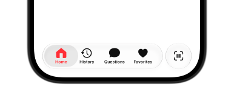
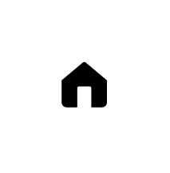

# Custom SF Symbol Home icon
Designed for developers who want a simple, polished home icon that fits naturally into modern SwiftUI and UIKit interfaces.

<p align="center">
  
</p>

<p align="center">
  A custom house symbol for your Apple apps.
</p>

---

## Features

* Designed specifically for Apple interfaces
* Works with SwiftUI and UIKit
* Available as an SVG symbol asset
* Supports use in iOS, iPadOS, macOS, and other Apple-platform projects
* Suitable for navigation, tab bars, home screens, dashboards, and more
* Free to use under the MIT License

---

## Preview

<p align="center">
  
</p>

### Symbol

```text
custom.house.fill
```

---

## Installation

### 1. Download the symbol

Download `custom.house.fill.svg` from this repository.

### 2. Add it to Xcode

In your Xcode project:

**Assets → Add New Asset → Symbol Image Set**

Then add the exported SVG file.

### 3. Use it in SwiftUI

```swift
Image("custom.house.fill")
```

You can then use the symbol anywhere you would normally use an image asset.

---

## SwiftUI Example

```swift
TabView {
  Tab("Home", image: "custom.house.fill") {
      HomeView()
  }
}
```

---

## UIKit

The symbol can also be included as an image asset in UIKit projects.

```swift
let image = UIImage(named: "custom.house.fill")
```

---

## What's Included

```text
custom.house.fill/
├── custom.house.fill.svg
├── Preview.png
├── Usage.png
├── README.md
└── LICENSE
```

---

## Created for Apple Developers

Built for developers who want beautiful, familiar iconography without having to create their own symbol from scratch.

If you use `custom.house.fill` in your project, feel free to ⭐ the repository.

